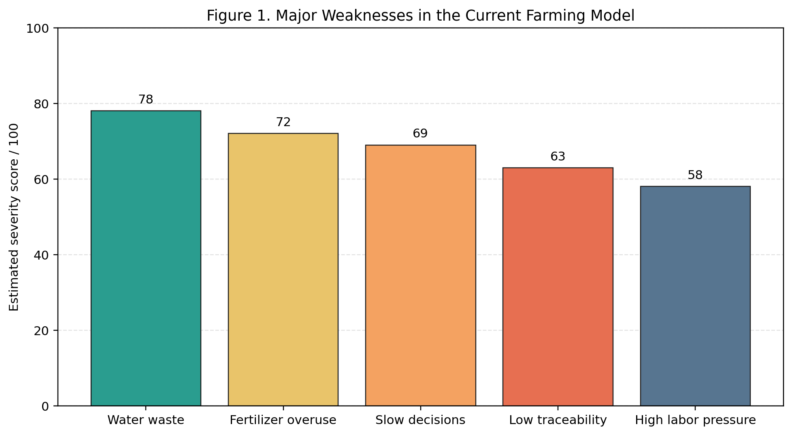
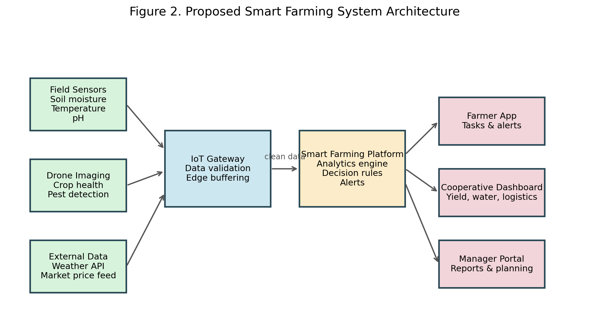
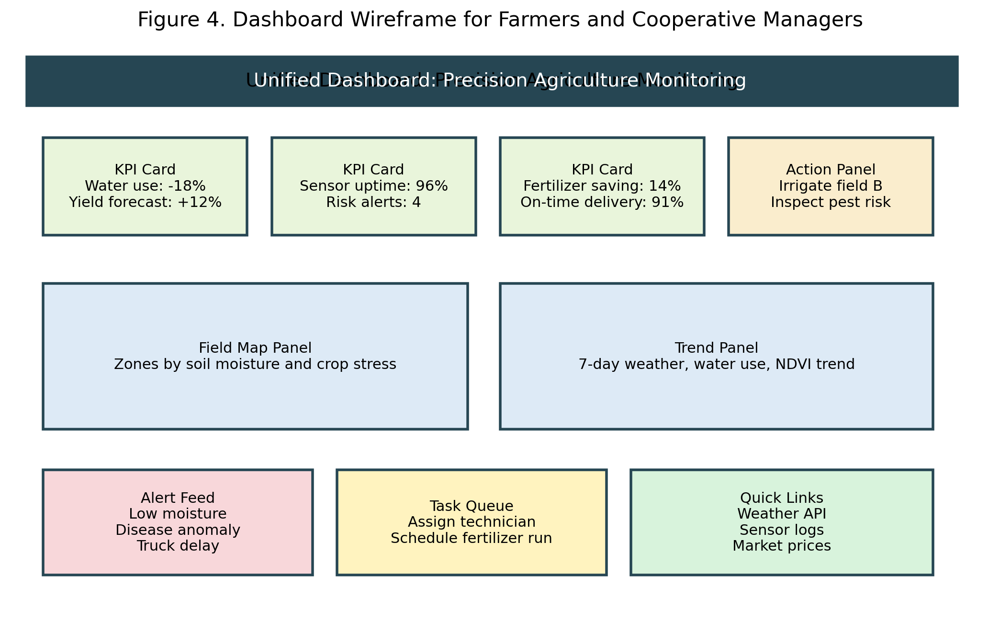
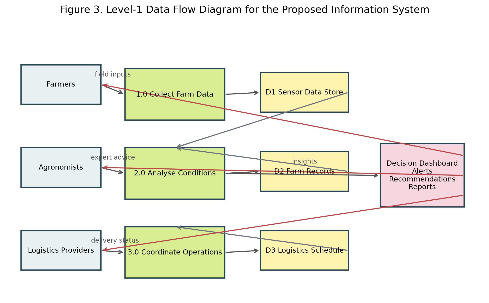
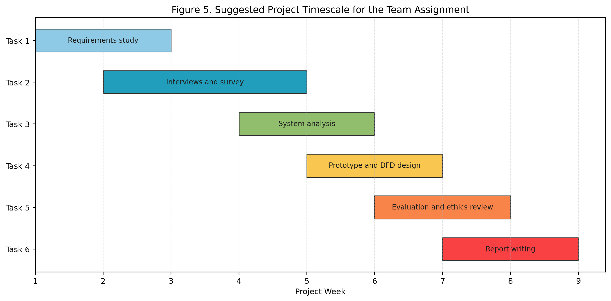

# Team Assignment Draft

Team Number: `XXX`  
Team Leader: `Name (English and Chinese)`  
Team Members: `Member 1`, `Member 2`, `Member 3`  
Student IDs: `XXXXXXXXXX`  
Emails: `example1@...`, `example2@...`, `example3@...`

## Report Title

**Designing a Data-Driven Precision Agriculture Information System for Regional Smart Farming**

Date: `24 April 2026`

## Executive Summary

This report presents a formal proposal for the design of a precision agriculture information system for a regional agricultural cooperative. The current operating environment is characterised by fragmented field data, delayed decision-making, inefficient use of resources, and weak coordination between production and logistics activities. Existing farming practices remain heavily dependent on manual observation, historical routines, and loosely connected communication channels, thereby limiting the cooperative's ability to respond effectively to changing soil conditions, weather patterns, and crop-health risks.

The proposed solution is an integrated smart farming platform that combines IoT-based soil sensing, drone-assisted crop imaging, external weather and market data, and a unified dashboard for farmers, agronomists, and cooperative managers. The proposed system is intended to support real-time monitoring, irrigation planning, fertiliser optimisation, pest-risk alerts, and logistics coordination. In addition, it incorporates role-based access control, secure cloud storage, and auditable data governance mechanisms to address operational reliability, privacy, and ethical responsibility.

The report analyses the current organisational and technical context, identifies stakeholder requirements through interviews and questionnaires, and develops a set of practical recommendations supported by data flow diagrams, a data dictionary, process specifications, and a prototype dashboard concept. The analysis indicates that the proposed information system could improve water-use efficiency, reduce unnecessary chemical inputs, enhance visibility across the agricultural supply chain, and contribute to more sustainable, resilient, and economically viable farming operations.

**Figure 1.** Major weaknesses in the current farming model.

## 1. Introduction

Precision agriculture refers to the use of sensing technologies, data analytics, digital communication systems, and decision-support tools to manage agricultural inputs and operations with greater accuracy and responsiveness. Rather than relying on uniform treatment across all fields according to a fixed seasonal schedule, smart farming enables decisions to be adapted to local soil conditions, crop stress indicators, weather variability, and changing market demands.

For regional agricultural cooperatives, the transition from traditional management practices to smart farming is not merely a technological upgrade; it is also a significant information systems challenge. Cooperative members often operate across geographically dispersed plots, maintain inconsistent forms of record-keeping, and rely on limited integration between planting, irrigation, agronomy, harvesting, and transportation activities. Consequently, many operational decisions are delayed, reactive, or based on incomplete and outdated information.

This report therefore focuses on the design of an integrated information system capable of supporting a regional agricultural cooperative in its movement towards a more responsive, efficient, and sustainable operating model. The report is aligned with the principal themes of the Info 200 course, including systems analysis, organisational modelling, project planning, information gathering, process modelling, and structured decision-making. It aims not only to propose a technical solution, but also to demonstrate how information systems thinking can be applied to a complex real-world agricultural setting.

## 2. Analysis of the Problem

### 2.1 Current Organisational Situation

The present farming model can be described as semi-manual, fragmented, and only weakly integrated. Field observations are commonly recorded through paper notes, telephone communication, or informal spreadsheets rather than through a standardised digital system. Irrigation and fertiliser schedules are typically determined by previous experience or fixed timetables rather than by sensor-based evidence. Drone or satellite imaging, where available, is used only occasionally and is not incorporated into routine decision-making. Furthermore, logistics information is largely separated from crop-condition data, with the result that harvesting and delivery coordination are often reactive rather than strategically planned.

The cooperative structure creates additional organisational complexity. Individual farmers may differ substantially in terms of digital literacy, land quality, crop type, and management priorities. Agronomists and cooperative managers therefore require a system capable of standardising essential data while remaining sufficiently flexible to reflect local field realities and practical working conditions.

### 2.2 Strengths of the Existing Model

- Farmers possess valuable tacit knowledge concerning local climate conditions, soil behaviour, and crop cycles.
- The cooperative already has an existing communication network and recognised operational authority.
- Current working routines provide a useful baseline from which redesigned processes can emerge.
- The existing model is familiar to users and therefore requires little immediate technical training.

### 2.3 Limitations of the Existing Model

- Data collection is inconsistent, decentralised, and rarely available in real time.
- Irrigation and fertiliser decisions are not sufficiently evidence-based.
- Crop stress, disease outbreaks, and pest conditions may be detected too late for effective intervention.
- Managers are unable to combine field data, inventory information, and logistics schedules within a single decision environment.
- Independent farmers may have legitimate concerns regarding data ownership, surveillance, and secondary data use.

### 2.4 Stakeholder Analysis

The proposed information system affects several stakeholder groups, each of whom has distinct operational needs and concerns:

- **Farmers:** require simple mobile access, timely alerts, and recommendations that can be translated into immediate field action.
- **Agronomists:** require accurate field data, image analysis capabilities, and comparison tools for diagnosis and intervention planning.
- **Cooperative managers:** require dashboards, planning tools, and performance reporting to support oversight and resource allocation.
- **Logistics providers:** require better forecasts of harvest volume, timing, and delivery windows.
- **Regulators and consumers:** benefit indirectly from improved traceability, sustainability reporting, and more accountable data handling.

### 2.5 Information Gathering Design

In order to understand stakeholder needs in a rigorous manner, the team should combine interactive and unobtrusive information-gathering methods. This mixed-methods approach is appropriate because it captures both expressed user expectations and observable operational realities.

**Interviews**

- Farmers: Which decisions are most difficult during irrigation, fertilisation, and pest control?
- Agronomists: Which data is currently missing when diagnosing crop problems?
- Managers: Which reports are most necessary for planning, supervision, and performance control?
- Logistics providers: What information gaps most commonly delay transport preparation?

**Questionnaire items**

1. How often do you use digital tools in farm operations?
2. Which problems cause the greatest production loss?
3. How useful would real-time moisture alerts be?
4. Which device do you prefer for system access: mobile phone, tablet, or desktop?
5. How concerned are you about privacy and data ownership?

**Unobtrusive methods**

- Review of existing field logs, irrigation records, and agronomic notes
- Observation of seasonal workflows and routine coordination practices
- Analysis of communication delays between farms and the cooperative office
- Inspection of current spreadsheets, paper forms, and reporting templates

## 3. Proposals and Solutions

### 3.1 Overview of the Proposed System

The proposed solution is a unified smart farming information system that gathers data from field sensors, drone imagery, and external data services, and then transforms that data into operationally meaningful recommendations. The proposed architecture is intentionally modular so that the cooperative can begin with a limited set of high-value functions, such as irrigation monitoring, before gradually expanding the system to include fertiliser management, pest detection, traceability, and market planning.

**Figure 2.** Proposed smart farming system architecture.

### 3.2 Core Functional Components

The recommended system comprises the following functional components:

- **IoT sensing layer:** soil moisture, soil temperature, pH, humidity, and weather sensors installed across representative field zones.
- **Aerial monitoring layer:** periodic drone imagery to identify crop stress, disease patterns, and irrigation gaps.
- **Data integration layer:** an IoT gateway and cloud platform for validating, storing, and combining data streams.
- **Decision-support layer:** rules and analytics for irrigation scheduling, fertiliser planning, anomaly detection, and yield forecasting.
- **Presentation layer:** mobile and web dashboards tailored to farmers, agronomists, and managers.

### 3.3 Recommended Innovations

The following innovations are recommended as part of the proposed system design:

1. A field-zoning approach so that each plot receives recommendations based on actual conditions rather than a uniform schedule.
2. Automated threshold alerts for low soil moisture, disease risk, and abnormal sensor readings.
3. A prioritised dashboard that presents urgent operational actions rather than raw data alone.
4. Shared visibility between production and logistics teams so that harvesting and transport can be coordinated earlier.
5. Traceable digital records to support sustainability reporting, accountability, and continuous improvement.

### 3.4 User-Centred Design Features

The proposed system should avoid overwhelming users with unnecessary technical complexity. A farmer-facing interface should therefore prioritise:

- colour-coded alerts,
- recommended actions,
- field-by-field status,
- offline-capable mobile access,
- large buttons and low-text interaction patterns,
- bilingual interface support where appropriate.

## 4. Evaluation of Solutions

### 4.1 Feasibility

The proposal is feasible because it can be implemented incrementally. The cooperative does not need to digitise every function simultaneously. A pilot phase can begin with a subset of farms and a limited set of use cases, such as irrigation optimisation and field-health monitoring.

From a technical perspective, the required technologies are already available and sufficiently mature for practical deployment. Sensor hardware, cloud services, web dashboards, and API-based weather integration are widely accessible. The principal challenge therefore lies not in technical possibility, but in user adoption, staff training, governance, and alignment with existing operational routines.

### 4.2 Expected Benefits

- Improved water-use efficiency through condition-based irrigation
- Better fertiliser targeting and lower environmental impact
- Faster response to pests, disease, and field anomalies
- Improved harvest planning and logistics coordination
- Stronger evidential support for management decisions and future investment

### 4.3 Risks and Mitigation

| Risk | Impact | Mitigation |
|---|---|---|
| Sensor failure or poor calibration | Inaccurate recommendations | Scheduled maintenance and validation checks |
| Low user adoption | Limited business value | Training, simple UI, pilot testing, feedback loops |
| Weak internet connectivity | Data delay in rural areas | Edge buffering and periodic synchronization |
| Privacy concerns | Resistance from farmers | Clear data governance and role-based access |
| Cost pressure | Slow rollout | Phased implementation and cooperative-level investment |

### 4.4 Ethical Considerations

Ethical considerations are central to the design of the proposed system. Farmers should understand what data is collected, why it is collected, who can access it, and how it may be used. Data should not be exploited in ways that weaken farmer autonomy or confer unfair advantage upon particular stakeholders. In addition, the system should avoid unnecessary algorithmic opacity by presenting recommendations in clear language and, wherever possible, by showing the indicators or thresholds on which those recommendations are based.

## 5. Design and Technology

### 5.1 Web 2.0 and Web 3.0 Perspective

The proposed platform is grounded primarily in Web 2.0 principles, including cloud-hosted services, user accounts, dashboards, interactive analytics, and collaborative information sharing. Nevertheless, selected Web 3.0 concepts may also be relevant, particularly in relation to traceability and trusted data exchange. For example, the cooperative could in future investigate tamper-evident records for crop origin, treatment history, or certification purposes if regulatory pressures or market requirements justify the additional complexity.

### 5.2 Prototype Dashboard Concept

The dashboard should combine monitoring, analysis, and action within a single interface. Rather than requiring users to navigate multiple disconnected tools, the design should present key indicators, urgent alerts, map-based status information, and direct links to external services such as weather APIs and market-price resources. This approach reflects the principle that an effective information system should reduce cognitive burden while improving operational visibility.

**Figure 4.** Dashboard wireframe for farmers and cooperative managers.

### 5.3 Data Flow Diagram

The information system must support the structured movement of data from farm actors and automated sensing tools into processing functions, data stores, and shared decision outputs. The following Level-1 DFD illustrates the principal data flows among users, system processes, repositories, and the final decision dashboard.

**Figure 3.** Level-1 data flow diagram for the proposed information system.

### 5.4 Data Dictionary

| Data Element | Description | Example | Source |
|---|---|---|---|
| `field_id` | Unique identifier for each field zone | F-12 | Farm records |
| `soil_moisture` | Percentage moisture level in soil | 24% | IoT sensor |
| `crop_health_index` | Calculated crop condition score | 0.81 | Drone analytics |
| `irrigation_status` | Current irrigation state | Active / Scheduled | Control system |
| `alert_level` | Priority of warning or issue | High | Analytics engine |
| `delivery_window` | Planned transport period | 15:00-18:00 | Logistics provider |

### 5.5 Process Specification Example

**Process 2.0: Analyse Conditions**

- Input: sensor readings, drone imagery, weather forecast data, and field records
- Logic:
  1. Validate incoming values and remove invalid records.
  2. Compare current values with crop thresholds and historical patterns.
  3. Detect abnormal conditions such as water stress or sudden temperature change.
  4. Produce recommended actions and alert levels.
- Output: recommendations, alerts, and dashboard summaries

## 6. Methodology

### 6.1 Development Approach

The project should follow an iterative systems analysis and design approach. Early activities should concentrate on understanding the organisational context, defining the principal decision problems, and identifying the minimum viable requirements for a pilot deployment. A prototype should then be tested with a small group of representative users before any wider rollout is attempted.

### 6.2 Research Methods

This report adopts a mixed-methods approach:

- qualitative interviews to identify stakeholder expectations and operational pain points,
- questionnaires to compare requirements across user groups,
- document analysis to review existing forms, records, and workflows,
- structured modelling to describe processes and information flows.

### 6.3 Suggested Timescale

**Figure 5.** Suggested project timescale for the team assignment.

### 6.4 Security, Storage, and Access Control

The proposed data-storage design should combine operational practicality with appropriate governance and control mechanisms:

- cloud-based storage for scalability and controlled shared access,
- encrypted data transfer between sensors, gateways, and servers,
- role-based access control for farmers, agronomists, managers, and administrators,
- audit logs for sensitive data access and administrative actions,
- retention rules aligned with legal and regulatory requirements,
- backup and recovery procedures to support operational continuity.

## 7. Conclusion and Recommendations

The analysis undertaken in this report demonstrates that the cooperative's current farming model is constrained by fragmented information, manual coordination practices, and a limited capacity for timely data-driven action. A precision agriculture information system offers a credible pathway towards more efficient and sustainable farm management by integrating sensing, analytics, and decision support within a coherent operational platform.

The principal recommendation is that implementation should proceed in phases. The first phase should focus on a pilot deployment involving selected fields, moisture sensors, weather-data integration, and a simplified dashboard for irrigation planning and alert management. Once practical value has been demonstrated and user feedback has been incorporated, the cooperative can extend the platform to include drone analytics, fertiliser optimisation, supply-chain visibility, and more advanced forecasting functions.

In conclusion, smart farming should not be pursued as technology for its own sake. It should instead be designed as a user-centred information system that improves everyday agricultural decision-making, strengthens environmental sustainability, and supports the long-term resilience of the farming community.

## Appendix A. Suggested Front Page Content

You can paste the following into the first page of the Word template:

`Team Number: XXX`  
`Team Leader: Name (English and Chinese) [ID]`  
`Team Members: Name 1 (English and Chinese) [ID], Name 2 (English and Chinese) [ID], Name 3 (English and Chinese) [ID]`  
`Emails: xxx@xxx.com, xxx@xxx.com, xxx@xxx.com`  
`Assignment Title: Precision Agriculture and Smart Farming Solutions`

## Appendix B. How to Use This Draft

1. Replace all placeholders with your real team information.
2. Copy each section into the corresponding part of the Word template.
3. Insert the generated PNG figures into the relevant positions in Word.
4. Revise the final wording as necessary to reflect your team's preferred level of formality and any additional evidence you wish to include.
